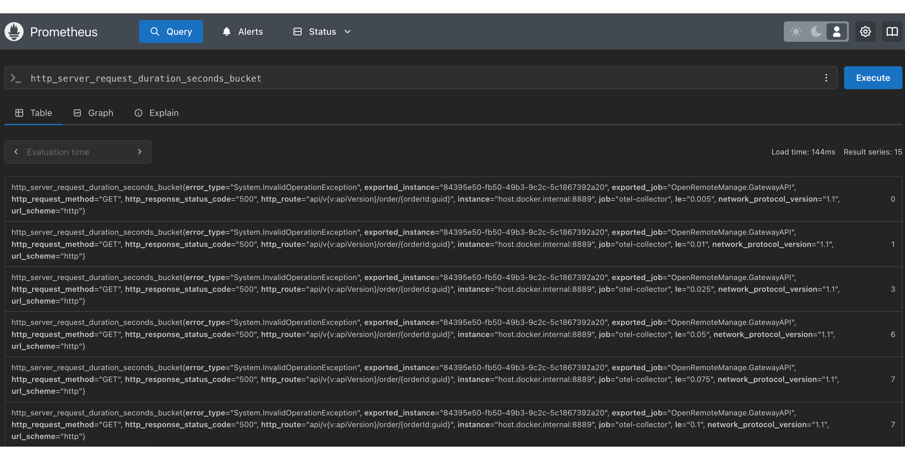

## Docker compose
Start all services:
docker-compose up -d

OrderAPI: http://localhost:8080/api/v1/orders

## Prometheus
Prometheus is a time-series database that collects metrics from the application.
The current otel collector container is configured to scrape the metrics (collected by OpenTelemetry) from the application to Prometheus.
Dashboard url:
```
http://localhost:9090/graph
```
Data source URL for grafana:
```
http://prometheus:9090
```
Sample query:


## Grafana
Dashboard URL: `http://localhost:3000/`
Default credentials: admin/admin

Add datasource Prometheus:


Prebuilt dashboards
- .NET Dashboard: https://grafana.com/orgs/dotnetteam
- Node Exporter (CPU, Memory): https://grafana.com/grafana/dashboards/1860-node-exporter-full/

Copy the dashboard ID and import it in Grafana:


